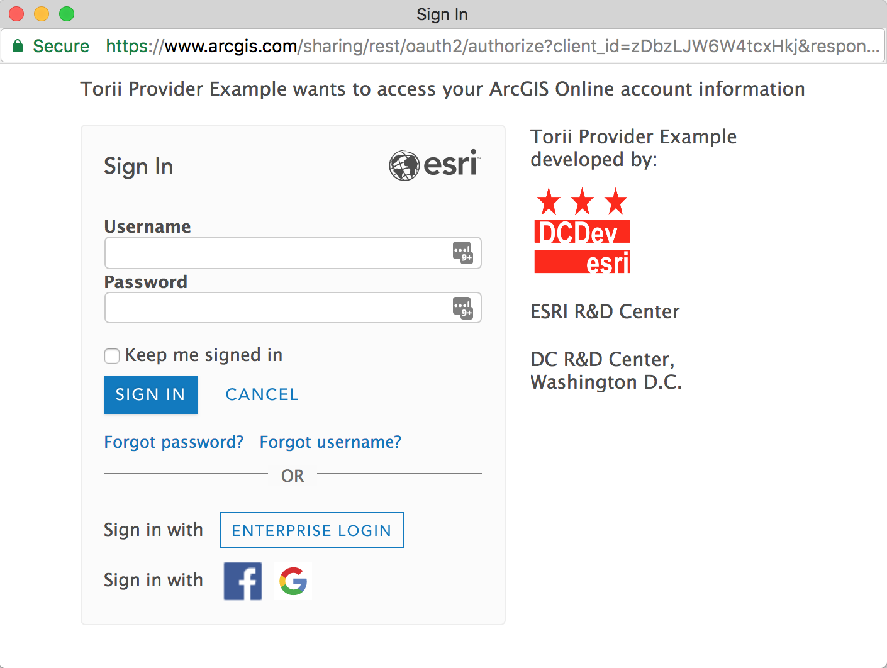

# Torii Provider ArcGIS

**Note** This package should be considered deprecated. Although still used in some production applications, support for this will end soon. The v4 release is expected to be the last.

> ArcGIS authentication provider & adapters for [Torii](https://github.com/Vestorly/torii), packaged as an [Ember CLI](https://github.com/ember-cli/ember-cli) Addon.



## Notes

This addon provides a convenient utility for [Ember.js](https://www.emberjs.com/) developers to add support for authenticating ArcGIS users using [OAuth 2.0](https://developers.arcgis.com/documentation/core-concepts/security-and-authentication/what-is-oauth-2/).

> Disclaimer: This is beta software. It does not currently handle federating ArcGIS Server credentials.

## Usage

Create a project using ember-cli.

```bash
$ ember new my-new-app
```

Add Torii and the ArcGIS Provider to the project

```bash
$ ember install torii
$ ember install torii-provider-arcgis
```

Now edit `/config/environment.js` to add your Torii provider configuration.

```js
module.exports = function (environment) {
  var ENV = {
    // ... other ENV config stuff here

    torii: {
      sessionServiceName: "session",
      providers: {
        "arcgis-oauth-bearer": {
          apiKey: "APP CLIENT ID GOES HERE",
          webTier: false, // optional - if true, support web-tier authentication in Portal
          loadGroups: false, // makes an additional API request to populate groups
          portalUrl: "https://someportal.com", //optional - defaults to https://arcgis.com
        },
      },
    },
  };

  return ENV;
};
```

**Note** If deploying to gh-pages, you will want to set a few more environment params:

```js
if (environment === "production") {
  ENV.locationType = "hash";
  ENV.rootURL = "/your-repo-name/";
}
```

## Torii Session

Usually the torii session is an opt-in feature, so - strictly speaking - you don't need to use it, but we recommend it, and this documentation assumes you are using it.

Torii injects the session into all routes and controllers, so you can just access it in a template.

We recommend passing data into components vs. having them pull in the session.

#### Session Properties

| Property          | Value                          | Description                                              |
| ----------------- | ------------------------------ | -------------------------------------------------------- |
| `isAuthenticated` | boolean                        | Is the session authenticated?                            |
| `isWorking`       | boolean                        | Is the session in transition?                            |
| `currentUser`     | object                         | the ArcGIS.com User                                      |
| `portal`          | object                         | the ArcGIS.com Portal object                             |
| `token`           | string                         | the token returned as part of the authentication process |
| `isGroupMember`   | boolean                        | Is the user a member of a particular group.              |
| `authType`        | string `"token" or "web-tier"` | type of authentication used                              |
| `userHubHome`     | string                         | URL for current user's hub home site                     |

Example usage

```js
//app/templates/secure.hbs
{{#if session.isAuthenticated}}
<h2>Hello {{session.currentUser.fullName}}</h2>
<ul>
  <li>Portal Name: {{session.portal.name}}</li>
  <li>Token: {{session.token}}</li>
</ul>
{{else}}
<p>Not authenticated</p>
{{/if}}
```

#### Session Methods

| Method                                | Return | Description                                                                                                                                                                    |
| ------------------------------------- | ------ | ------------------------------------------------------------------------------------------------------------------------------------------------------------------------------ |
| `isInRole('roleName')`                | bool   | is the current user in the specified role                                                                                                                                      |
| `isInAnyRole(['role1', 'role2'])`     | bool   | is the current user in any of the specified roles                                                                                                                              |
| `hasPrivilege('privName')`            | bool   | does the current user have the specified privilege                                                                                                                             |
| `hasAnyPrivilege(['priv1', 'priv2'])` | bool   | does the current user have the specified privilege                                                                                                                             |
| `isInOrg('orgId')`                    | bool   | is the current user a member of the specified org                                                                                                                              |
| `isInAnyOrg(['orgId1', 'orgId2'])`    | bool   | is the current user a member of any of the specified orgs                                                                                                                      |
| `portalHostName()`                    | string | returns a protocol-less hostname for the portal i.e. `www.arcgis.com` or `dcdev.maps.arcgis.com`                                                                               |
| `portalRestUrl()`                     | string | returns https url for the portal api i.e. `https://www.arcgis.com/sharing/rest` or `https://dcdev.maps.arcgis.com/sharing/rest`. Respects ArcGIS Enterprise httpsPort settings |

Example Usage

```js
//app/routes/privileged.js
...
beforeModel(){
  let session = this.get('session');
  if(!session.isAuthenticated){
    this.transitionTo('signin');
  }else{
    if(!session.hasPrivilege('some:priv')){
      this.transitionTo('notauthorized');
    }
  }
}

```

## ArcGIS Authentication Options

The ArcGIS Platform has a few types of authentication, based on OAuth2. For all the details, please consult the [documentation](https://developers.arcgis.com/documentation/core-concepts/security-and-authentication/).

#### Named User Login

Since your application will not be running on a sub-domain of ArcGIS.com, you will need to use a 'pop-up' based authentication flow.

With this model, you need to register an application at [developers.arcgis.com](https://developers.arcgis.com).

Next, at [developers.arcgis.com](https://developers.arcgis.com) you need to register a Redirect URI for the application - this should be the url where your web application lives.

**Note:** You can add multiple Redirect URI's for a single application, including `http://localhost`, which is convenient for development.

Once that's complete, you will need to copy the 'client id', and put it into the torii provider as noted above.

To initiate authentication with this flow, typically you will use a button and have it's action initiate the "opening" of a session.

In your application, on the controller or route where this button lives, add an action like:

```js
//app/routes/application.js
import Ember from "ember";
export default Ember.Route.extend({
  actions: {
    signin: function () {
      this.get("session")
        .open("arcgis-oauth-bearer")
        .then((authorization) => {
          Ember.debug("AUTH SUCCESS: ", authorization);
          // transition to some secured route or... so whatever is needed
          this.controller.transitionToRoute("secure");
        })
        .catch((err) => {
          Ember.debug("AUTH ERROR: ", err);
        });
    },
  },
});
```

When this action is fired, it will open the session, which will utilize torii to open a pop-up window with the ArcGIS.com login displayed.

#### Esri Hosted Applications

Esri hosted applications (hosted on a subdomain of arcgis.com) can have the ArcGIS.com login page embedded in an iframe.

There are a few additional configuration parameters required for the `torii-provider-arcgis` configuration so that the url that is constructed for the iframe has the correct parameters.

```js
//config/environment.js
module.exports = function (environment) {
  var ENV = {
    // ... other ENV config stuff here

    torii: {
      sessionServiceName: "session",
      providers: {
        "arcgis-oauth-bearer": {
          apiKey: "ESRI-WELL-KNOWN-APPLICATION-ID",
          portalUrl: "https://somePortal.com", //optional - defaults to https://www.arcgis.com
          remoteServiceName: "iframe",
          display: "iframe",
          showSocialLogins: true, //optional, will default to false
          customRedirectUri: "https://someUrl.com/custom-redirect", //optional, but allows for deeper customization
        },
      },
    },
  };

  return ENV;
};
```

Since torii is really designed to work with 'pop-up' style OAuth, in order to have the login page injected in the iframe on a specific template (i.e. /signin), we need to do a little more work.

Torii has a iframe placeholder component, and this needs to be in the DOM before we can call `session.open`. So we add it into the signin template

```js
//app/templates/signin.hbs
{
  {
    torii - iframe - placeholder;
  }
}
```

But - just adding it won't do anything - we still need a means to open the session _after_ the DOM has been rendered. We do this by adding some code into the route.

```js
//app/routes/signin.js
import Ember from "ember";
export default Ember.Route.extend({
  actions: {
    //this will fire once the route has fully transitioned
    //but the DOM may not be done rendering yet...
    didTransition: function () {
      //so we schedule it to run afterRender
      Ember.run.schedule("afterRender", this, function () {
        this.get("session")
          .open("arcgis-oauth-bearer")
          .then((authorization) => {
            Ember.debug("AUTH SUCCESS: ", authorization);
            //transition to secured route etc...
            this.controller.transitionToRoute("secure");
          })
          .catch((err) => {
            Ember.debug("AUTH ERROR: " + JSON.stringify(err));
          });
      });
    },
  },
});
```

## Running the Addon Locally

The torii example app at ArcGIS.com is configured to use
`http://torii-example.com:4200/redirect.html` as their redirect
uri, so you will need to make an alias in your hosts file that points
**torii-example.com** to localhost, and you must view the examples from
that same host.

To use the ArcGIS Online authentication you need to run the app on **localui.arcgis.com** so you should also make an alias for this.

To add this hostname on a Mac:

- `sudo vim /etc/hosts`
- Add `127.0.0.1 torii-arcgis-provider-example.com`
- Add `127.0.0.1 localui.arcgis.com`

The `/etc/hosts` equivalent filepath on Windows is:
`%SystemRoot%\system32\drivers\etc\hosts`.

For more info, see [Hosts at wikipedia](<http://en.wikipedia.org/wiki/Hosts_(file)>).

### Linting

- `npm run lint:hbs`
- `npm run lint:js`
- `npm run lint:js -- --fix`

### Running tests

- `ember test` – Runs the test suite on the current Ember version
- `ember test --server` – Runs the test suite in "watch mode"
- `ember try:each` – Runs the test suite against multiple Ember versions

### Running the dummy application

- `ember serve`
- Visit the dummy application at [http://localhost:4200](http://localhost:4200).

## Resources

- [ArcGIS Hub](http://doc.arcgis.com/en/hub/)
- [ArcGIS for Developers](https://developers.arcgis.com/)
- [ArcGIS Blog](http://blogs.esri.com/esri/arcgis/)
- [twitter@esri](http://twitter.com/esri)

## Issues

Find a bug or want to request a new feature? Please let us know by submitting an issue.

### Contributing

- `git clone` this repository
- `npm install`
- `bower install`

Esri welcomes contributions from anyone and everyone. Please see our [guidelines for contributing](https://github.com/Esri/contributing/blob/master/CONTRIBUTING.md).

### License

Copyright (c) 2016-2018 Esri

Licensed under the Apache License, Version 2.0 (the "License");
you may not use this file except in compliance with the License.
You may obtain a copy of the License at

> http://www.apache.org/licenses/LICENSE-2.0

Unless required by applicable law or agreed to in writing, software
distributed under the License is distributed on an "AS IS" BASIS,
WITHOUT WARRANTIES OR CONDITIONS OF ANY KIND, either express or implied.
See the License for the specific language governing permissions and
limitations under the License.

A copy of the license is available in the repository's [LICENSE](./LICENSE) file.
